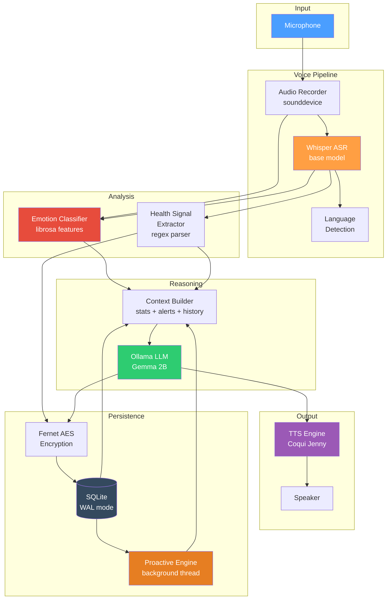
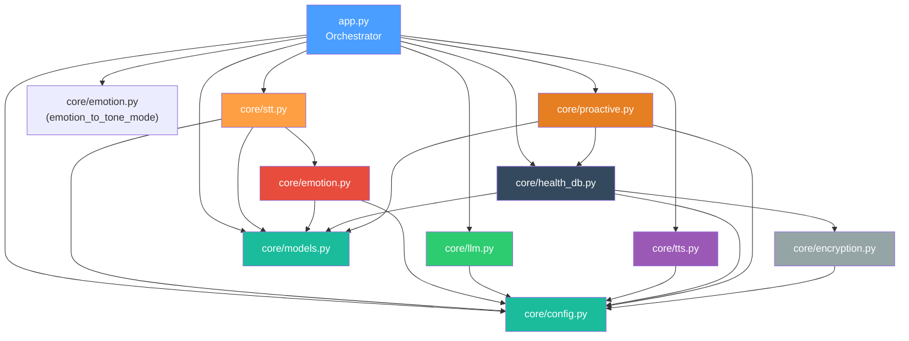
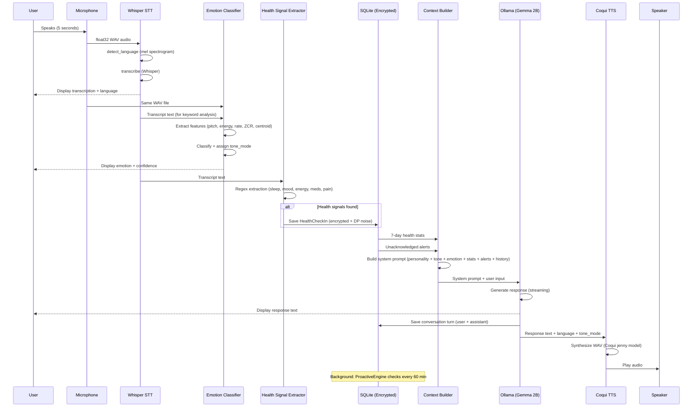
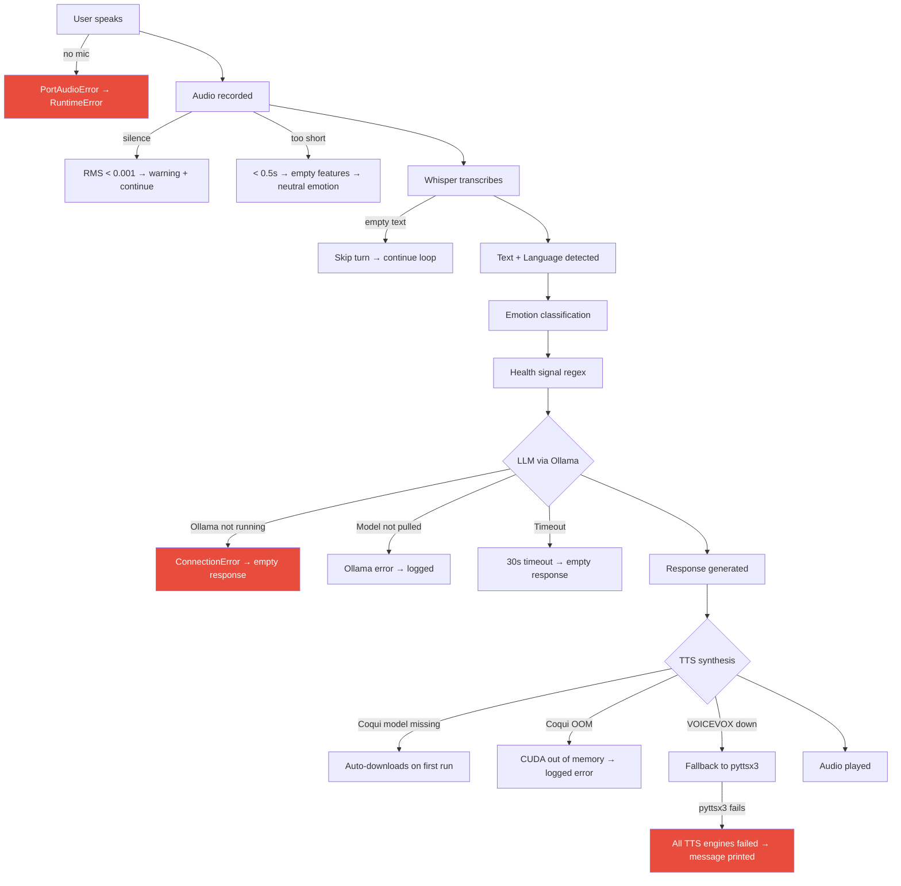
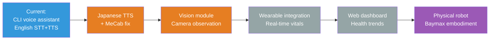

# Aegis — Technical Architecture Documentation

> **Version:** 0.1.0  
> **Last updated:** 2025-06-23  
> **Language / Runtime:** Python 3.10+ · Whisper · Ollama (Gemma 2B) · Coqui TTS · SQLite  
> **Architecture style:** Offline voice-first pipeline with emotion-aware proactive health engine  

---

## Table of Contents

1. [System Overview](#1-system-overview)  
2. [Architecture Breakdown](#2-architecture-breakdown)  
3. [Domain Model](#3-domain-model)  
4. [Execution Flow](#4-execution-flow)  
5. [Key Design Decisions](#5-key-design-decisions)  
6. [Failure & Edge Case Analysis](#6-failure--edge-case-analysis)  
7. [Security & Privacy](#7-security--privacy)  
8. [Developer Onboarding Guide](#8-developer-onboarding-guide)  
9. [Suggested Improvements](#9-suggested-improvements)  
10. [Future Roadmap](#10-future-roadmap)  

---

## 1. System Overview

### Purpose

Aegis is a **fully offline, voice-first personal health AI** designed to run entirely on a local machine with no cloud dependencies. It combines speech recognition, emotion detection from audio features, a health-aware language model, encrypted local storage, and a proactive monitoring engine into a single conversational loop.

The system blends the gentle care of Baymax, the responsiveness of JARVIS, and the privacy-conscious localization of on-device AI. Every byte of data — audio, transcriptions, health records, and conversation history — stays on the user's hardware.

### High-Level Architecture



### Core Responsibilities

| Responsibility | Owner |
|---|---|
| Audio capture & silence detection | `core/stt.py` — `record_audio()` |
| Speech-to-text transcription | `core/stt.py` — Whisper model |
| Language detection | `core/stt.py` — Whisper `detect_language()` |
| Emotion classification from prosody | `core/emotion.py` — rule-based classifier |
| Health signal extraction from text | `core/llm.py` — `extract_health_signals()` |
| Context-aware response generation | `core/llm.py` — `get_response()` via Ollama |
| Emotion-adaptive speech synthesis | `core/tts.py` — Coqui (EN) / VOICEVOX (JA) |
| Encrypted health data persistence | `core/health_db.py` + `core/encryption.py` |
| Background proactive analysis | `core/proactive.py` — `ProactiveEngine` |
| Orchestration & conversation loop | `app.py` — `main()` |

---

## 2. Architecture Breakdown

### Major Components

#### Orchestrator (`app.py`)

The main entry point. Runs an infinite conversation loop with 10 discrete steps per turn. Handles graceful shutdown via `SIGINT`, initializes all subsystems, and prints a status dashboard for each turn.

Key functions:
- `main()` — Conversation loop orchestration (record → transcribe → emotion → health → LLM → TTS)
- `on_proactive_alert()` — Callback for background alerts
- `print_status()` — Formatted status output
- `shutdown()` — Graceful cleanup (stop proactive engine, close DB)

#### Speech-to-Text (`core/stt.py`)

Local ASR using OpenAI's Whisper model. Lazy-loads the model on first use. Records audio via `sounddevice`, checks for silence (RMS threshold), and transcribes with automatic language detection.

Key functions:
- `_get_model()` — Lazy Whisper model loader (configurable size: tiny/base/small/medium)
- `record_audio()` — Mic recording with silence detection (RMS < 0.001 warning)
- `transcribe_audio()` — Whisper transcription + language detection via mel spectrogram
- `listen_and_analyze()` — Combined pipeline: record → transcribe → analyze emotion

#### Emotion Detection (`core/emotion.py`)

Rule-based emotion classifier operating on audio features extracted by librosa. Combines prosodic analysis (pitch, energy, speech rate) with linguistic keyword spotting in both English and Japanese.

Features extracted:
- **Pitch (F0)** via `librosa.pyin` — mean and standard deviation
- **Energy** via RMS amplitude
- **Speech rate** via onset detection (events/second)
- **Zero crossing rate** — correlates with noisiness/breathiness
- **Spectral centroid** — brightness of the voice

Classification rules:

| Signal | High Value → | Low Value → |
|---|---|---|
| Pitch | stressed / anxious | fatigued / calm |
| Pitch variance | anxious / stressed | — |
| Energy (RMS) | stressed / anxious | fatigued / calm |
| Speech rate | anxious / stressed | fatigued / calm |
| Keywords | category-specific boost (+0.20) | — |

Key functions:
- `extract_audio_features()` — Full librosa feature extraction pipeline
- `classify_emotion()` — Weighted rule-based scoring → normalized → argmax
- `analyze_emotion()` — Convenience: features + classification in one call
- `emotion_to_tone_mode()` — Maps emotion label to LLM response tone

#### Health-Aware LLM (`core/llm.py`)

Interfaces with Ollama's local API to generate health-context-aware responses. Builds a rich system prompt combining the Aegis personality, current emotion state, response tone modifier, health statistics, active proactive alerts, and recent conversation history.

Key functions:
- `build_health_context()` — Assembles the full system prompt with:
  - Base system prompt (Aegis personality)
  - Tone modifier (calm / encouraging / gentle support / neutral)
  - Current emotion context
  - 7-day health statistics summary
  - Active proactive alerts
  - Recent conversation history
- `get_response()` — Sends context + user input to Ollama, streams response. Adds explicit language instruction for non-English input.
- `extract_health_signals()` — Regex-based extraction of sleep hours, mood/energy levels, medication status, and pain mentions from user text.

**Language handling:** When `language != "en"`, a `[LANGUAGE]` block is injected into the system prompt requiring the LLM to respond entirely in the detected language with 3–5 sentences of detail.

#### Text-to-Speech (`core/tts.py`)

Multi-backend TTS with emotion-adaptive speech parameters. English uses Coqui TTS (Jenny model). Japanese uses VOICEVOX with auto-start detection, falling back to pyttsx3 (Windows SAPI5).

Key components:
- `_get_coqui()` — Lazy Coqui TTS loader with PyTorch `add_safe_globals` compatibility guard
- `_synthesize_english()` — Coqui synthesis to WAV file
- `_synthesize_japanese()` — VOICEVOX HTTP synthesis → pyttsx3 fallback
- `_ensure_voicevox_running()` — Auto-detects and launches VOICEVOX from PATH/common install locations
- `speak_text()` — Main entry: synthesize → play audio
- `_play_audio()` — Platform-specific audio playback (Windows `start`, Linux `aplay`/`afplay`)

**Emotion adaptation:** The `tone_mode` parameter adjusts speech rate factor (0.85× for gentle support, 0.9× for calm, 1.0× for neutral/encouraging). The Coqui model's inherent prosody handles most tonal variation.

#### Encrypted Health Store (`core/health_db.py`)

SQLite database with Fernet encryption on sensitive text fields and differential privacy noise on numeric health metrics.

Tables:

| Table | Purpose | Encrypted Fields |
|---|---|---|
| `health_checkins` | Daily mood/sleep/energy/pain records | `user_text`, `pain_notes`, `notes` |
| `medication_reminders` | Active medication schedules | — |
| `vital_records` | Heart rate, BP, SpO2, temperature, steps | — |
| `proactive_alerts` | Generated alerts with severity + acknowledgment | `message` |
| `conversation_history` | Full conversation log with emotion + tone | `content` (via session) |

Key features:
- WAL mode for crash safety
- `sanitize_for_storage()` applies Laplace noise to `mood_score`, `sleep_hours`, `energy_level` before persistence
- Foreign keys enabled
- Indexed on timestamp columns for efficient proactive queries

#### Encryption & Privacy (`core/encryption.py`)

Data-at-rest encryption using Fernet (AES-128-CBC with HMAC-SHA256). The encryption key is auto-generated and stored locally with restricted permissions.

Key functions:
- `load_or_create_key()` — Auto-generates Fernet key on first run, persists to `data/db/.aegis_key`
- `encrypt_string()` / `decrypt_string()` — String-level encryption/decryption
- `add_laplace_noise()` — Differential privacy noise injection (configurable epsilon)
- `sanitize_for_storage()` — Applies DP noise to specified numeric fields

**Privacy budget:** ε = 1.0 (configurable). Laplace mechanism with sensitivity = 1.0. Can be disabled via `ENABLE_DIFFERENTIAL_PRIVACY = False`.

#### Proactive Engine (`core/proactive.py`)

Background daemon thread that periodically analyzes stored health data and generates alerts when concerning patterns are detected. Runs every 60 minutes (configurable).

Pattern detectors:

| Check | Trigger Condition | Severity |
|---|---|---|
| `_check_mood_pattern()` | ≥3 days with mood ≤ 3/10 | warning |
| `_check_sleep_deficit()` | Avg sleep < 5.0 hours over 7 days | warning |
| `_check_medication_compliance()` | Past schedule time + 30min, no confirmation | info |
| `_check_vital_signs()` | HR ≥ 100 bpm (+ stress = warning, else info) | info/warning |
| `_check_emotion_pattern()` | ≥3 negative emotions in 5 check-ins | warning |
| `_check_energy_trend()` | Declining trend + avg < 4/10 | info |

Alerts are saved to the database and surfaced via the `on_alert` callback, which prints them to the conversation interface.

#### Configuration (`core/config.py`)

Central configuration with sensible defaults. No environment variables — all config is code-level.

Key configuration groups:
- **Paths:** `BASE_DIR`, `DATA_DIR`, `DB_DIR`, `AUDIO_DIR`, auto-created on import
- **Audio:** 16 kHz sample rate, 5s default recording duration
- **Whisper:** Model size (`base`)
- **Ollama:** URL (`localhost:11434`), model (`gemma:2b`), context window (4096)
- **TTS:** Coqui model (`jenny`), VOICEVOX URL/speaker ID
- **Emotion:** Pitch/energy/rate thresholds in `EmotionConfig` dataclass
- **Proactive:** Check intervals, mood/sleep/HR thresholds in `ProactiveConfig` dataclass
- **Privacy:** Differential privacy epsilon, enable flag
- **System prompt:** Full Aegis personality definition
- **Tone modes:** Modifier text + speech rate factor for calm/encouraging/gentle_support/neutral

### Dependency Relationships



### External Integrations

| System | Protocol | Purpose |
|---|---|---|
| Ollama | HTTP REST (`localhost:11434`) | Local LLM inference (Gemma 2B) |
| VOICEVOX (optional) | HTTP REST (`localhost:50021`) | Japanese speech synthesis |
| Microphone | PortAudio / sounddevice | Audio capture |
| System speaker | OS native (`start` / `aplay` / `afplay`) | Audio playback |

All integrations are **localhost-only**. No external network calls are made.

---

## 3. Domain Model

### Key Entities

#### EmotionResult

```python
@dataclass
class EmotionResult:
    label: str          # calm / stressed / anxious / fatigued / neutral
    confidence: float   # 0.0 – 1.0
    pitch_mean: float   # Hz
    pitch_std: float    # Hz
    energy_rms: float   # RMS amplitude
    speech_rate: float  # approx words per second
    timestamp: str      # ISO 8601
```

#### HealthCheckIn

```python
@dataclass
class HealthCheckIn:
    id: str                         # 12-char UUID hex
    timestamp: str                  # ISO 8601
    mood_score: Optional[float]     # 1–10
    sleep_hours: Optional[float]
    energy_level: Optional[float]   # 1–10
    pain_notes: Optional[str]
    medication_taken: Optional[bool]
    user_text: Optional[str]        # raw transcription (encrypted at rest)
    detected_emotion: Optional[str]
    emotion_confidence: Optional[float]
    notes: Optional[str]
```

#### ProactiveAlert

```python
@dataclass
class ProactiveAlert:
    id: str                     # 12-char UUID hex
    timestamp: str              # ISO 8601
    alert_type: str             # e.g. "low_mood_pattern", "sleep_deficit"
    severity: str               # "info" / "warning" / "urgent"
    message: str                # Human-readable alert text
    acknowledged: bool          # Whether user has seen this
    context: Dict[str, Any]     # Supporting data (avg_mood, low_sleep_days, etc.)
```

#### Session & ConversationTurn

```python
@dataclass
class ConversationTurn:
    role: str           # "user" or "assistant"
    content: str
    timestamp: str
    emotion: Optional[str]
    tone_mode: Optional[str]

@dataclass
class Session:
    id: str
    started_at: str
    turns: List[ConversationTurn]
    emotion_history: List[EmotionResult]
    active: bool
```

### Database Schema

```sql
CREATE TABLE health_checkins (
    id TEXT PRIMARY KEY,
    timestamp TEXT NOT NULL,
    mood_score REAL,           -- DP noise applied before storage
    sleep_hours REAL,          -- DP noise applied before storage
    energy_level REAL,         -- DP noise applied before storage
    pain_notes TEXT,           -- Fernet encrypted
    medication_taken INTEGER,
    user_text TEXT,            -- Fernet encrypted
    detected_emotion TEXT,
    emotion_confidence REAL,
    notes TEXT                 -- Fernet encrypted
);

CREATE TABLE proactive_alerts (
    id TEXT PRIMARY KEY,
    timestamp TEXT NOT NULL,
    alert_type TEXT NOT NULL,
    severity TEXT DEFAULT 'info',
    message TEXT,              -- Fernet encrypted
    acknowledged INTEGER DEFAULT 0,
    context TEXT               -- JSON blob
);

CREATE TABLE conversation_history (
    id INTEGER PRIMARY KEY AUTOINCREMENT,
    session_id TEXT,
    role TEXT NOT NULL,
    content TEXT NOT NULL,
    timestamp TEXT NOT NULL,
    emotion TEXT,
    tone_mode TEXT
);
```

### Data Transformations

| Stage | Transformation |
|---|---|
| Audio capture | Microphone → float32 NumPy array → WAV file |
| Transcription | WAV → mel spectrogram → Whisper → (text, language) |
| Emotion analysis | WAV → librosa features → rule-based scorer → EmotionResult |
| Health extraction | Text → regex patterns → dict of sleep/mood/energy/medication/pain |
| LLM context | Stats + alerts + history + emotion + tone → system prompt string |
| LLM inference | System prompt + user text → Ollama HTTP → response text |
| TTS synthesis | Response text → Coqui/VOICEVOX → WAV file → speaker |
| Storage | HealthCheckIn → DP noise on numerics → Fernet encrypt text → SQLite |

### Important Invariants

1. **All data stays local.** No HTTP calls leave `localhost`. The only network communication is to Ollama (`localhost:11434`) and optionally VOICEVOX (`localhost:50021`).
2. **Encryption key is auto-generated on first run** and stored at `data/db/.aegis_key`. Losing this file makes existing encrypted data unrecoverable.
3. **Differential privacy is applied before storage**, not at query time. Stored numeric values are already noised — original values are never persisted.
4. **Emotion classification is session-scoped.** No persistent emotion model is trained; each audio segment is independently classified.
5. **The proactive engine is advisory only.** It generates alerts but never modifies health data or sends notifications outside the terminal.
6. **One session per process lifetime.** A new `Session` is created each time `app.py` starts. Session history persists in the database across runs.

---

## 4. Execution Flow

### Per-Turn Conversation Pipeline



### Startup Sequence

1. Print ASCII banner
2. Initialize `HealthDatabase` (create/open SQLite, ensure schema)
3. Create new `Session`
4. Start `ProactiveEngine` (daemon thread)
5. Register `SIGINT` handler for graceful shutdown
6. Check for unacknowledged alerts from previous sessions → display
7. Enter conversation loop

### Shutdown Sequence

1. `SIGINT` received (Ctrl+C)
2. `ProactiveEngine.stop()` — signal thread to exit, join with 5s timeout
3. `HealthDatabase.close()` — close SQLite connection
4. Print farewell message
5. `sys.exit(0)`

---

## 5. Key Design Decisions

### Why This Structure Exists

The project follows a **flat module structure** (`core/` package with specialized modules) rather than a layered architecture. This is intentional — Aegis is a **single-process, single-user** application where simplicity and debuggability matter more than scalability or service isolation.

Each module in `core/` owns one concern (STT, TTS, emotion, LLM, storage, proactive) and exposes a small public API. The orchestrator (`app.py`) composes them into a linear pipeline.

### Trade-offs Visible in the Implementation

| Decision | Trade-off |
|---|---|
| **Whisper `base` model** | Good accuracy/speed balance. `tiny` is faster but less accurate; `medium`/`large` are better but use much more VRAM. |
| **Rule-based emotion classifier** | No training data needed, works offline, transparent. But less accurate than ML models (e.g. wav2vec2 + SER head). |
| **Gemma 2B via Ollama** | Runs on consumer GPUs (4GB VRAM). Larger models (7B, 13B) give better responses but need more resources. |
| **Regex health signal extraction** | Simple, deterministic, no ML overhead. Misses complex expressions ("I haven't been sleeping well lately"). |
| **Fernet encryption (symmetric)** | Simple key management (one file). No PKI infrastructure. But key compromise = full data access. |
| **Laplace DP noise before storage** | Protects against database theft. But aggregated stats are slightly inaccurate. Epsilon=1.0 is moderate privacy. |
| **Single-threaded conversation loop** | Simple, predictable. But blocks during recording, transcription, LLM inference, and TTS synthesis (~15-20s per turn). |
| **SQLite (no server)** | Zero ops, zero config, single-file database. But no concurrent access, no remote access, no replication. |
| **Coqui TTS Jenny model** | High-quality English neural TTS. But ~500MB model, slow on CPU (~5-10s per sentence). |
| **Background proactive engine** | Can alert between turns. But daemon thread has no way to interrupt the current turn. |

### Observability Patterns

| Pattern | Implementation |
|---|---|
| **Structured logging** | Python `logging` module with `[module_name]` prefix, `INFO` level default |
| **Status dashboard** | Per-turn `print_status()` showing STT result, language, emotion, tone, health signals |
| **Alert display** | Proactive alerts printed to terminal with severity icon (`i` / `!` / `!!`) |
| **Silence detection** | RMS < 0.001 logged as warning, user notified |

**Not yet implemented:** Metrics export, log file rotation, turn timing measurement, emotion trend visualization.

---

## 6. Failure & Edge Case Analysis

### Where Failures May Occur



### Error Handling Strategy

| Layer | Strategy |
|---|---|
| **Audio recording** | `PortAudioError` → `RuntimeError` raised → caught in main loop → retry |
| **Silence** | RMS check → warning printed → turn continues (transcription may be empty) |
| **Transcription** | Exception → returns `("", "en")` — graceful degradation |
| **Emotion classification** | All features zero → defaults to `neutral` with low confidence |
| **LLM** | `ConnectionError` / timeout → returns fallback message, doesn't crash |
| **TTS (EN)** | Coqui failure → logged error, audio not played (conversation continues) |
| **TTS (JA)** | VOICEVOX failure → pyttsx3 fallback → if both fail, message printed |
| **Database** | SQLite WAL mode prevents corruption. Schema auto-created on startup. |
| **Proactive engine** | Exceptions caught per-cycle. Thread continues running. |
| **Main loop** | `RuntimeError` → retry turn. `Exception` → log + recover. `KeyboardInterrupt` → shutdown. |

### Potential Technical Debt

1. **Blocking pipeline.** Each turn blocks for ~15-20s (5s recording + 3-5s transcription + 2-3s LLM + 3-5s TTS). No async/parallel execution.
2. **Regex health signal extraction is brittle.** Only catches explicit patterns like "I slept 6 hours." Misses paraphrased or contextual mentions.
3. **No model version pinning.** Whisper, Coqui, and Ollama models are specified by name but not by hash/version. Model updates could change behavior.
4. **Proactive engine checks are time-based.** It runs every 60 minutes regardless of whether new data exists. A data-change-triggered approach would be more efficient.
5. **No conversation export/backup.** If the SQLite file or encryption key is lost, all health history is gone. No backup mechanism exists.
6. **Audio playback uses `os.system()`.** Non-blocking on Windows (`start`), blocking on Linux (`aplay`). Cross-platform behavior is inconsistent.

---

## 7. Security & Privacy

### Encryption at Rest

| Layer | Mechanism |
|---|---|
| Sensitive text fields (`user_text`, `pain_notes`, `notes`, `message`) | Fernet (AES-128-CBC + HMAC-SHA256) |
| Numeric health metrics (`mood_score`, `sleep_hours`, `energy_level`) | Laplace differential privacy noise |
| Encryption key | Auto-generated, stored at `data/db/.aegis_key`, `chmod 600` on Unix |

### Privacy Design

| Principle | Implementation |
|---|---|
| **No cloud calls** | All inference on `localhost`. No telemetry, no analytics. |
| **Data minimization** | Only health-relevant signals extracted and stored. Raw audio deleted after processing. |
| **Differential privacy** | Noise injected with ε=1.0 before storage. Exact values never persisted. |
| **No PII export** | No API endpoints, no network services. Data accessible only via SQLite file. |
| **Crash safety** | WAL mode SQLite prevents partial writes. |

### Threat Model

| Threat | Mitigation | Gap |
|---|---|---|
| Physical device theft | Fernet encryption on sensitive fields | Encryption key stored on same device — no HSM |
| Eavesdropping on localhost | Ollama and VOICEVOX communicate over loopback only | No TLS on localhost (not strictly needed) |
| Malicious audio injection | Audio comes from physical microphone only | No speaker verification / voice authentication |
| Model extraction | No model serving endpoint exposed | Whisper/Coqui models are standard open-source weights |
| Key compromise | `chmod 600` on key file | Windows doesn't support Unix permissions — ACL needed |

---

## 8. Developer Onboarding Guide

### Prerequisites

- **Python 3.10+** (tested with 3.11 on Conda)
- **Ollama** running locally with `gemma:2b` pulled
- **CUDA-compatible GPU** recommended (CPU fallback works but is slow)
- **Working microphone** for voice input
- **VOICEVOX** (optional, for Japanese TTS)
- **ffmpeg** in PATH (required by Whisper)

### Setup

**1. Clone and install dependencies:**

```bash
git clone <repo_url>
cd KAI
pip install -r requirements.txt
```

**2. Pull the LLM model:**

```bash
ollama pull gemma:2b
```

**3. Run Aegis:**

```bash
python app.py
```

On first run, the system will:
- Download the Whisper `base` model (~150MB)
- Download the Coqui TTS `jenny` model (~500MB)
- Generate an encryption key at `data/db/.aegis_key`
- Create the SQLite database at `data/db/aegis_health.db`

### Environment Variables

No environment variables required. All configuration lives in `core/config.py`.

### Key Configuration Parameters

| Parameter | Default | Location | Description |
|---|---|---|---|
| `WHISPER_MODEL_SIZE` | `"base"` | `config.py` | Whisper model variant |
| `OLLAMA_MODEL` | `"gemma:2b"` | `config.py` | Ollama model name |
| `OLLAMA_URL` | `localhost:11434` | `config.py` | Ollama API endpoint |
| `RECORD_DURATION_DEFAULT` | `5` | `config.py` | Recording duration in seconds |
| `COQUI_MODEL_EN` | `jenny` | `config.py` | English TTS model |
| `DIFFERENTIAL_PRIVACY_EPSILON` | `1.0` | `config.py` | DP privacy budget |
| `PROACTIVE_CONFIG.check_interval_minutes` | `60` | `config.py` | Background check interval |

### How to Add a New Feature

**Adding a new proactive health check:**

1. Add the check method to `ProactiveEngine` in `core/proactive.py` (e.g. `_check_hydration()`)
2. Add the call to `run_analysis()`
3. Define any new thresholds in `ProactiveConfig` dataclass in `core/config.py`
4. The check should return `List[ProactiveAlert]` — alerts are automatically saved and surfaced

**Adding a new health signal extractor:**

1. Add the regex pattern to `extract_health_signals()` in `core/llm.py`
2. Map the extracted field to `HealthCheckIn` in `app.py` step 4
3. If it's a numeric field that needs DP noise, add it to `HealthDatabase.NOISY_NUMERIC_FIELDS`

**Adding a new TTS backend:**

1. Add a `_synthesize_<name>()` function in `core/tts.py`
2. Add the backend selection logic to `speak_text()` (keyed on language or config flag)
3. Add any configuration to `core/config.py`

---

## 9. Suggested Improvements

### Critical (Correctness)

| Issue | Risk | Fix |
|---|---|---|
| **No LLM fallback** | If Ollama is not running, turns produce empty responses | Add a rule-based fallback response generator for common health queries |
| **No audio input validation** | Corrupted/empty WAV files could crash Whisper | Validate WAV header and duration before transcription |

### High (Reliability)

| Issue | Risk | Fix |
|---|---|---|
| **Blocking pipeline** | 15-20s per turn, UI feels unresponsive | Use `asyncio` or `concurrent.futures` to parallelize LLM + TTS |
| **No model health check on startup** | User discovers missing models mid-conversation | Verify Ollama model + Whisper model + Coqui model on startup |
| **No turn timeout** | Stuck LLM inference blocks forever | Add configurable timeout to Ollama HTTP call (currently 30s but no graceful fallback) |
| **pyttsx3 threading issues** | pyttsx3 can deadlock in threaded contexts | Use subprocess isolation for pyttsx3 calls |

### Medium (Operational)

| Issue | Risk | Fix |
|---|---|---|
| **No database backup** | Data loss if SQLite file corrupted/deleted | Periodic SQLite backup via `.backup` API |
| **No log file** | Debug info lost on terminal close | Add `FileHandler` to logging config with rotation |
| **No config file** | Requires code changes to adjust parameters | Add YAML/TOML config file loaded at startup |
| **No turn timing** | Can't profile slow steps | Add per-step timing in the conversation loop |
| **Audio playback via `os.system`** | Platform inconsistency, no error handling | Use `sounddevice` or `pygame.mixer` for playback |

### Low (Code Quality)

| Issue | Impact | Fix |
|---|---|---|
| **`__pycache__` in git** | Binary files in repo | Add `__pycache__/` to `.gitignore` (already done) |
| **Magic numbers in emotion classifier** | Weights like 0.25, 0.20 not configurable | Move weights to `EmotionConfig` dataclass |
| **No type hints on some dict returns** | IDE autocompletion incomplete | Add `TypedDict` for health stats return types |

### Architecture Evolution Path



---

## 10. Future Roadmap

### Phase 1 — Language Completion (Current)
- Fix Japanese TTS via VOICEVOX (MeCab dictionary path, auto-start)
- Improve Japanese LLM responses (more natural phrasing)
- Add language-specific emotion keywords

### Phase 2 — Vision Module
- Camera-based health observation (posture, facial expression, eye fatigue)
- Visual emotion analysis complementing audio features
- Activity recognition (sitting, standing, exercising)

### Phase 3 — Wearable Integration
- Real-time heart rate, SpO2, temperature from wearable devices
- BLE/USB data ingestion pipeline
- Alert thresholds for real vital signs (not just self-reported)

### Phase 4 — Dashboard & Insights
- Local web UI (Flask/Streamlit) for health trend visualization
- Exportable health reports (PDF)
- Long-term pattern analysis with statistical models

### Phase 5 — Physical Embodiment
- Baymax-inspired companion robot
- Embedded compute (Jetson / Raspberry Pi)
- Physical gestures and LED expressions
- Proximity-based automatic activation

---

## Appendix: Project Structure Reference

```
KAI/
├── app.py                        # Main orchestrator — conversation loop
├── requirements.txt              # Python dependencies
├── README.md                     # Project overview + setup guide
├── ARCHITECTURE.md               # This document
├── .gitignore                    # Excludes __pycache__, *.wav, data/
├── core/
│   ├── __init__.py               # Package init (__version__ = "0.1.0")
│   ├── config.py                 # Central configuration (paths, thresholds, prompts)
│   ├── models.py                 # Dataclasses (EmotionResult, HealthCheckIn, Session, etc.)
│   ├── encryption.py             # Fernet AES encryption + Laplace differential privacy
│   ├── emotion.py                # Audio emotion detection (librosa features + rules)
│   ├── health_db.py              # Encrypted SQLite health store (5 tables, WAL mode)
│   ├── proactive.py              # Background proactive health engine (6 pattern checks)
│   ├── llm.py                    # Health-aware LLM (Ollama + context builder + signal extraction)
│   ├── stt.py                    # Whisper STT + emotion pipeline (record → transcribe → analyze)
│   └── tts.py                    # Multi-backend TTS (Coqui EN + VOICEVOX JA + pyttsx3 fallback)
└── data/                         # Auto-created at runtime (not committed)
    ├── db/
    │   ├── aegis_health.db       # Encrypted SQLite database
    │   └── .aegis_key            # Fernet encryption key
    ├── audio/
    │   ├── input.wav             # Last recorded audio
    │   └── aegis_response.wav    # Last TTS output
    ├── logs/
    └── models/
```
